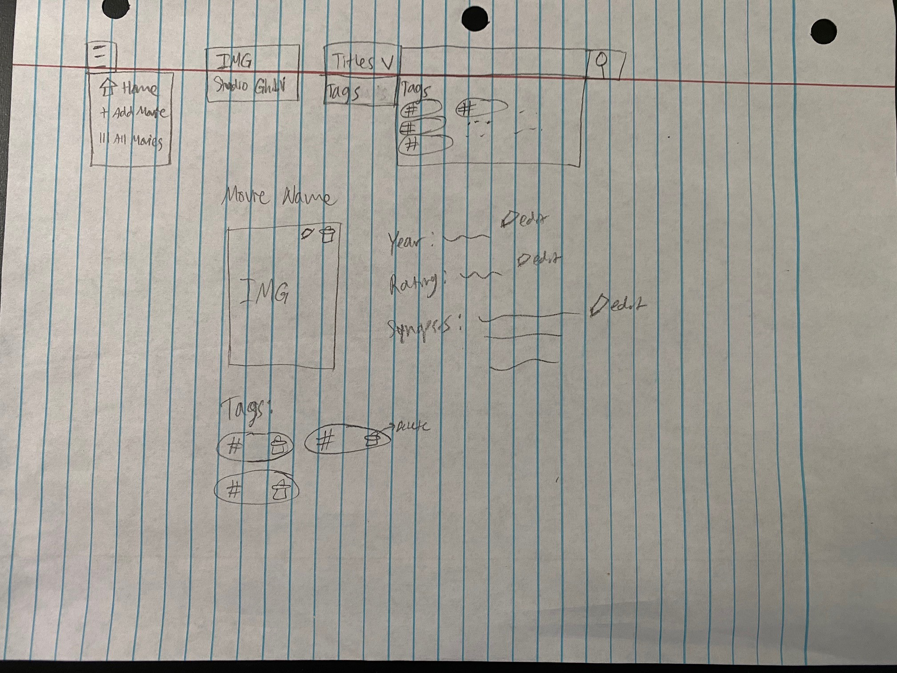
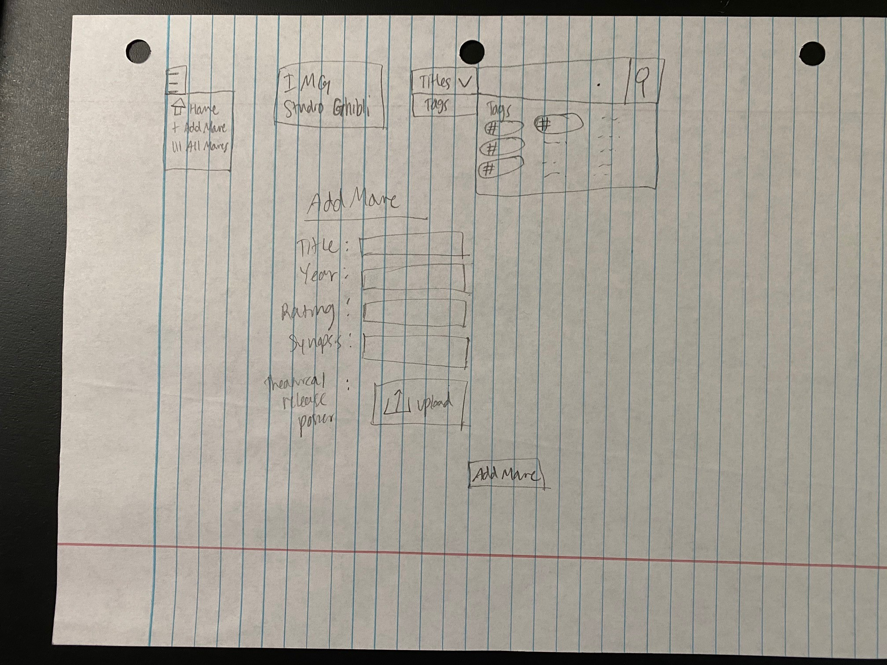

# Project 3: Design Journey

Be clear and concise in your writing. Bullets points are encouraged.

**Everything, including images, must be visible in VS Code's Markdown Preview.** If it's not visible in Markdown Preview, then we won't grade it.

# Design & Plan (Milestone 1)

## Describe your Gallery (Milestone 1)
> What will your gallery be about? 1 sentence.

- My gallery will be a movie catalog of Studio Ghibli movies

> Will you be using your existing Project 1 or Project 2 site for this project? If yes, which project?

- I will be using my Project 2 website

> If using your existing Project 1 or Project 2, please upload sketches of your final design here.


## Target Audience(s) (Milestone 1)
> Tell us about your target audience(s).

- My target audience are people looking for a new Studio Ghibli movie to watch or who want to share a Studio Ghibli movie they have seen.


## Design Process (Milestone 1)
> Document your design process. Show us the evolution of your design from your first idea (sketch) to design you wish to implement (sketch). Show us the process you used to organize content and plan the navigation (card sorting), if applicable.
> Label all images. All labels must be visible in VS Code's Markdown Preview.
> Clearly label the final design.


### First interation
- I decided to allow the user to view all tags by having a list popup when the user is doing a search, it gives the website a more clean look and to be quite honest, the user only needs to see all the tags when they are doing a search so it makes the most sense
- I decided to have a dropdown for two fields this time because I am assuming that the tags will be the provider of key content that the user can search for so that I don't have to use SQL commands to search through every field.
- The only thing that I don't really like about this design is the Add movie button. I think it is in a bit of an awkward location
- I also don't think it's a great idea to cram all the movies onto the home page


### Second interation
- The only thing I really changed is placement of the nav bar. I made a dropdown style nav bar to make the heading of the page less crowded and to draw most of the attention to the search bar.






### Third interation (final)
- All other pages are the same as before except for the image details page and the form. I added options to add tags on both of these pages


## Design Patterns (Milestone 1)
> Explain how your site leverages existing design patterns for image galleries.
> Identify the parts of your design that leverage existing design patterns and justify their usage.
> Most of your site should leverage existing patterns. If not, fully explain why your design is a special case (you need to have a very good reason here to receive full credit).

- Most movie catalogs show the name of the movie underneath the picture of the movie. Unlike an image gallery where you are primarily looking at the photos, my target audience needs to know the name of the movie so it makes the most sense to show them the name directly instead of forcing them to hover. The movies are also laid out in rows and not one giant column. That way there isn't just blank space on the right side.

- Most movie catalogs provide a photo of the movie on the left side and details on the right. Since this seems pretty standard for most movie catalogs, I will arrange my content this way too

- The delete and edit buttons are menu items and not "submit" style buttons. Since I am allowing users to edit all details of a movie, it would be too crowded to have a submit style button for everything.

- In general, best practice for forms is that on desktop, the label and input field should be on one line. In addition, the labels should be flush right and inputs should be flush left, so I am going to follow that best practice with my form too

- Most image galleries/movie catalogs have a search at the top of the page. This will draw attention to the search bar

- Most movie catalogs organize the movies based off of popularity or recent releases. Unlike an image gallery, movie catalogs have to provide more information about the movies. I can't just have a bunch of photos of different movies because that would confuse the user. Also since my target audience wants to figure out what movies to watch, catagorizing my photos this way provides more information about the movie to the user

- Most movie catalogs show the name of the movie underneath the picture of the movie. Again, unlike an image gallery where you are primarily looking at the photos, my target audience needs to know the name of the movie so it makes the most sense to show them the name directly instead of forcing them to hover.

- Most movie catalogs show the name of the movie underneath the picture of the movie. Again, unlike an image gallery where you are primarily looking at the photos, my target audience needs to know the name of the movie so it makes the most sense to show them the name directly instead of forcing them to hover. The movies are also laid out in rows and not one giant column. That way there isn't just blank space on the right side.


## Requests (Milestone 1)
> Identify and plan each request you will support in your design.
> List each request that you will need (e.g. view image details, view gallery, etc.)
> For each request, specify the request type (GET or POST), how you will initiate the request: (form or query string param URL), and the HTTP parameters necessary for the request.

- Request: search movie with a specific tag
    - Type: GET
    - Params: tag_search and field

- Request: search movie with a specific title
    - Type: GET
    - Params: title_search and field

- Request: view movie information
    - Type: GET
    - Params: id

- Request: add a movie
    - Type: POST
    - Params: title, year, rating, synopsis, image

- Request: delete movie photo
    - Type: POST
    - Params: image_id

- Request: replace movie photo
    - Type: POST
    - Params: image_id

- Request: update information
    - Type: POST
    - Params: title or year or rating or synopsis

- Request: add tags
    - Type: POST
    - Params: tag_id, tag_name

- Request: delete tags
    - Type: POST
    - Params: tag_id, tag_name


## Database Schema Design (Milestone 1)
> Plan the structure of your database. You may use words or a picture.
> Make sure you include constraints for each field.

> Hint: You probably need `images`, `tags`, and `image_tags` tables.

> Hint: For foreign keys, use the singular name of the table + _id. For example: `image_id` and `tag_id` for the `image_tags` table.

```
movies (
id : INTEGER {PK, U, Not, AI}
name: TEXT {U, Not}
year: INTEGER {}
rating: TEXT {}
synopsis: TEXT {}
image_id: INTEGER {}
)

images (
id : INTEGER {PK, U, Not, AI}
image_name: TEXT {U, Not}
image_ext: TEXT {Not}
)

tags (
id : INTEGER {PK, U, Not, AI}
tag_name: TEXT {U, Not}
)

image_to_tag(
    id : INTEGER {PK, U, Not, AI}
    image_id: INTEGER {Not}
    tag_id: INTEGER {Not}
)


```


## Database Query Plan (Milestone 1)
> Plan your database queries. You may use natural language, pseudocode, or SQL.
> Using your request plan above, plan all of the queries you need.
```sql
SELECT movies.name , images.id FROM ghibli INNER JOIN images ON ghibli.id=images.movie_id WHERE movie.name LIKE '%' || :search || '%';
SELECT movies.name , images.id FROM ghibli INNER JOIN images ON ghibli.id=images.movie_id INNER JOIN tags ON images.id=tags.images_id WHERE tags.tag_name LIKE '%' || :search || '%';
INSERT INTO movies (all fields) VALUES (values from input);
INSERT INTO images (all fields) VALUES (values from input);
UPDATE movies SET image_id=(id of that image) WHERE (moviename=...)
-- works for other fields too
DELETE FROM images WHERE image.id=();
UPDATE movies SET image_id IS NULL;
INSERT INTO tags (all fields) VALUES (values from input);
DELETE FROM tags WHERE tag.id=();
SELECT * movies WHERE movie.id=...;
```

## Code Planning (Milestone 1)
> Plan what top level PHP pages you'll need.
- Home Page
- Form Page

> Plan what partials you'll need.
- Nav Bar
- Movie details page formatting
- list of tags partial

> Plan any PHP code you'll need.

```
function printtable {
    print header
        for each record
            print all fields
}


if tag is valid{
    add tag to the tags table
    add image_id to the tag
}

if post request to add movie{
    insert sql query
    add corresponding foreign keys
}

if post request to delete movie{
    delete sql query
    delete all corresponding foreign keys
}

if get request for search{
    if valid search and valid field{
        return results of search
    } else{
        print error message
    }
}

if get request to view movie information{
    return proper query string parameter
}

if uploaded image has correct file size and extension{
    insert into images table
    update foreign keys
}
function movieblock {
    display movie and title
}
```


# Complete & Polished Website (Final Submission)

## Gallery Step-by-Step Instructions (Final Submission)
> Write step-by-step instructions for the graders.
> For each set of instructions, assume the grader is starting from index.php.

Viewing all images in your gallery:
1. You can view all the images on index.php
2.

View all images for a tag:
1. search the tag in the search bar
2.

View a single image and all the tags for that image:
1. Click on the image
2. You will be taken to a separate page with details

How to upload a new image:
1. Go to the add movie form in the nav bar
2. Fill out all the fields
3. Click the add movie button
4. There should be a confirmation

How to delete an image:
1. Go to the image details page of the image you want to delete
2. Hover over the title of the movie
3. A trash can icon will show up
4. Click the trash can
5. This should take you to a confirmation page

How to view all tags at once:
1. You will see all the tags on the form page
2. When you perform a search the tags will also show up

How to add a tag to an existing image:
1. Click on the image for which you would like to add a tag
2. There will be an add tag form at the bottom
3. Enter the tag and hit the plus button to add it

How to remove a tag from an existing image:
1. Click on the image from which you would like to remove a tag
2. Hover over the list of tags
3. Click on the X button next to the tag you want to delete


## Reflection (Final Submission)
> Take this time to reflect on what you learned during this assignment. How have you improved since starting this class?
